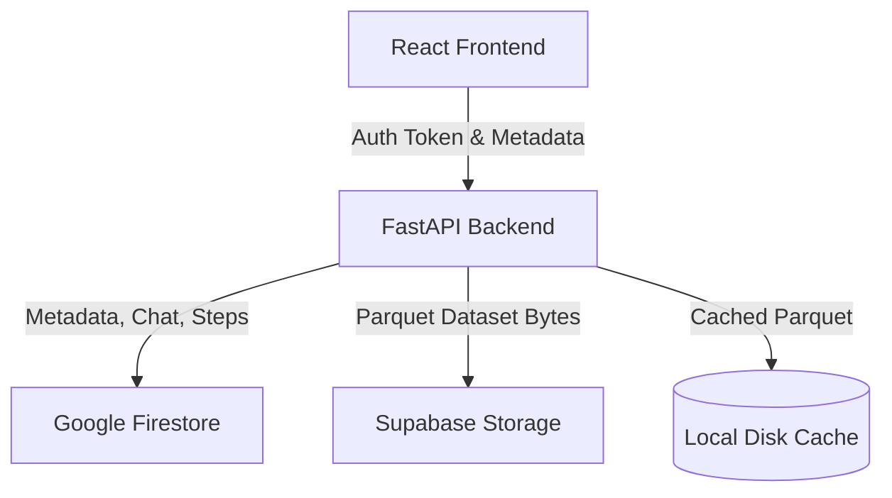

# Architecture Documentation

## Storage Architecture (Dual-Storage Strategy)

Aegis Pipeline Studio employs a dual-storage strategy to utilize the free tiers of Google Firebase and Supabase, thereby minimizing operating costs during initial stages.

### Storage Map

1. **Google Cloud Firestore (Metadata & Session State)**:
   * **Role**: Primary source of truth for user accounts, session settings, chat history, visual pipeline DAG structures (steps and edges), saved persistent webhook pipelines (`saved_pipelines` collection), and pipeline execution logs.
   * **Rationale**: Fast document-oriented lookups, real-time sync friendly metadata structure, and seamless integration with Firebase Auth.

2. **Supabase Storage (Raw Data Blob Store)**:
   * **Role**: Primary source of truth for raw uploaded file bytes and standardized, processed datasets in Apache Parquet format.
   * **Rationale**: High limits for file uploads/bandwidth under free tier, standard object storage interface.

3. **Local Server Disk (Ephemeral Cache)**:
   * **Role**: Read/write cache for Parquet data frames currently being loaded and executed through pandas.
   * **Rationale**: Direct local file reads are required for low-latency pandas DAG step operations. If a worker instance does not find a dataset locally (e.g. in multi-instance horizontal scaling), it pulls down the Parquet file from Supabase Storage on-demand.

---

## Degraded States & Failure Seams

Because storage is split across Firestore and Supabase, failure states must be handled gracefully:

1. **Firestore Down / Supabase Up**:
   * If Firestore write fails, local memory cache retains session data for current request cycle, but metadata cannot be synced. 
   * If Firestore read fails during a GET, Aegis falls back to checking the local in-process memory cache to serve the session if possible.

2. **Supabase Down / Firestore Up**:
   * File upload and data ingest will fail since the raw bytes and Parquet files cannot be uploaded to object storage.
   * Session metadata is still created in Firestore but marked as degraded or incomplete due to missing parquet storage reference.

---

## Triggers for Consolidation

This dual-storage setup is a cost-driven design decision. The system should be consolidated into a single storage provider (e.g., migrating fully to Supabase or GCP) under any of the following triggers:

> [!IMPORTANT]
> **Consolidation Revisit Triggers:**
> - **Enterprise Onboarding**: Reconsider consolidating before onboarding the first enterprise customer, since a dual-cloud data-flow layout doubles the complexity of the data-flow diagrams and compliance documentation that enterprise procurement and security audits will request.
> - **Cross-Cloud Latency**: If the network latency between Firebase (Google Cloud) and Supabase (AWS/Fly.io depending on region) starts significantly affecting upload/download ingest times.
> - **Exceeding Free Tiers**: Once the active user base grows to the point where paid tiers on both platforms are triggered, consolidating into a single provider will simplify billing and architecture.
