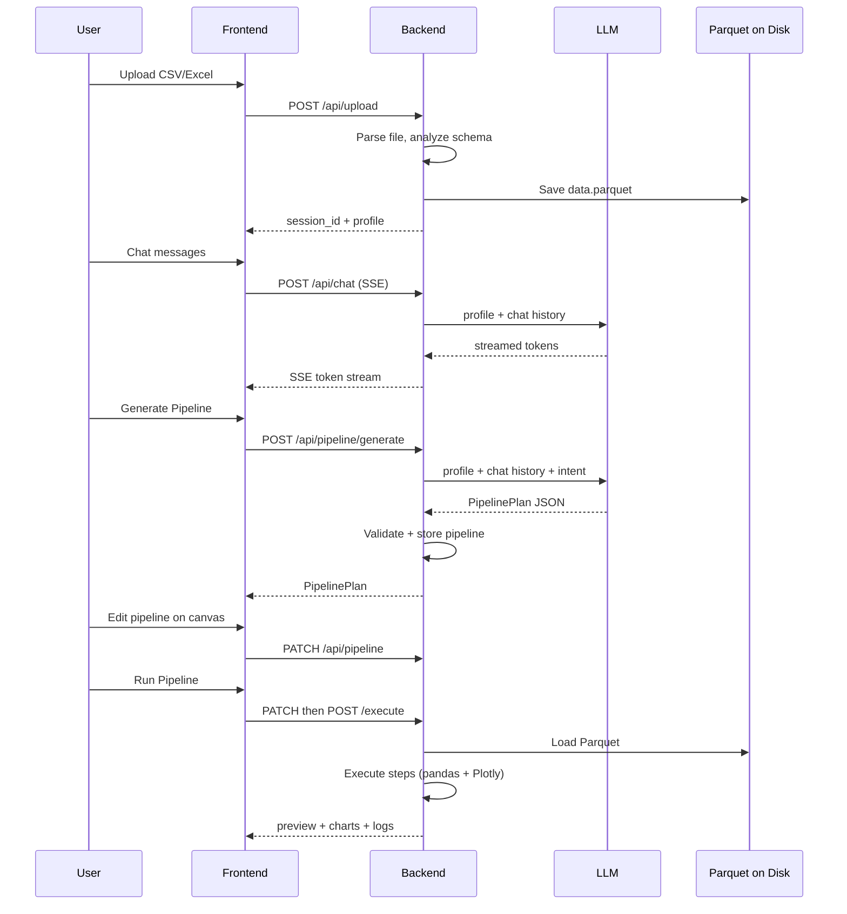

# How Aegis Works Behind the Scenes

This document explains what happens under the hood when you use Aegis — from file upload through AI conversation, pipeline generation, execution, and visualization. It is written for developers, reviewers, and technical stakeholders who want to understand the system without reading every source file.

---

## Table of Contents

1. [What Aegis Is](#what-aegis-is)
2. [High-Level Architecture](#high-level-architecture)
3. [The End-to-End User Journey](#the-end-to-end-user-journey)
4. [Upload and Session Management](#upload-and-session-management)
5. [The Privacy Boundary](#the-privacy-boundary)
6. [Agent Chat (LLM Conversation)](#agent-chat-llm-conversation)
7. [Pipeline Generation](#pipeline-generation)
8. [The Pipeline DSL](#the-pipeline-dsl)
9. [Pipeline Execution](#pipeline-execution)
10. [Visualization](#visualization)
11. [Frontend Internals](#frontend-internals)
12. [API Reference](#api-reference)
13. [Configuration and Deployment](#configuration-and-deployment)
14. [Security Model](#security-model)
15. [Known Limitations](#known-limitations)

---

## What Aegis Is

Aegis is an **agentic data analysis platform**. You upload a CSV or Excel file, chat with an AI agent about what you want to learn from the data, and the agent produces an editable visual data pipeline. You can tweak that pipeline in a drag-and-drop editor, run it, and see charts, a data preview, and step-by-step execution logs.

The core design principle is **privacy-first analysis**:

- The LLM never receives raw row data.
- All data transformation and chart rendering happen **locally on the server** using pandas and Plotly.
- The LLM only sees **dataset metadata** (column names, types, null rates, row counts) plus your **chat messages**.

---

## High-Level Architecture

```
┌─────────────────────────────────────────────────────────────────────────┐
│                         Browser (React SPA)                             │
│  ┌──────────────┐  ┌─────────────────────┐  ┌───────────────────────┐ │
│  │  Agent Chat  │  │  Pipeline Canvas    │  │  Results Dashboard    │ │
│  │  (SSE stream)│  │  (React Flow editor)│  │  (Plotly + table)     │ │
│  └──────┬───────┘  └──────────┬──────────┘  └───────────┬───────────┘ │
│         │                     │                           │             │
│         └─────────────────────┼───────────────────────────┘             │
│                               │  HTTP /api/* (Vite proxy in dev)        │
└───────────────────────────────┼─────────────────────────────────────────┘
                                ▼
┌─────────────────────────────────────────────────────────────────────────┐
│                      FastAPI Backend (Python)                           │
│                                                                         │
│  ┌─────────┐  ┌──────────┐  ┌────────────┐  ┌──────────┐  ┌────────┐ │
│  │ Upload  │  │   Chat   │  │  Pipeline  │  │ Executor │  │  Viz   │ │
│  │ Ingest  │  │  Agent   │  │  Generate  │  │ (pandas) │  │(Plotly)│ │
│  └────┬────┘  └────┬─────┘  └─────┬──────┘  └────┬─────┘  └───┬────┘ │
│       │            │              │               │              │      │
│       └────────────┴──────────────┴───────────────┴──────────────┘      │
│                               │                                         │
│                    ┌──────────┴──────────┐                              │
│                    │   Session Store   │                              │
│                    │  (in-memory +     │                              │
│                    │   Parquet on disk)│                              │
│                    └───────────────────┘                              │
└───────────────────────────────┬─────────────────────────────────────────┘
                                │  LiteLLM (metadata + chat only)
                                ▼
                    ┌───────────────────────┐
                    │  External LLM Provider │
                    │  OpenAI / Anthropic /  │
                    │  Ollama / etc.         │
                    └───────────────────────┘
```

| Layer | Technology | Role |
|-------|------------|------|
| Frontend | React 18, TypeScript, Vite, Tailwind | UI, pipeline editor, chart rendering |
| Pipeline editor | React Flow (`@xyflow/react`) | Visual DAG editing |
| Charts (client) | Plotly.js (`react-plotly.js`) | Interactive chart display |
| Backend | FastAPI, pandas | API, data processing, execution |
| AI | LiteLLM | Provider-agnostic LLM calls |
| Charts (server) | Plotly (Python) | Chart JSON generation |
| Storage | In-memory sessions + Parquet files | Session state and raw data |

---

## The End-to-End User Journey



| Step | What the user sees | What happens behind the scenes |
|------|-------------------|-------------------------------|
| 1. Upload | Dropzone accepts file | File parsed, profile computed, Parquet saved, UUID session created |
| 2. Chat | Streaming assistant replies | LiteLLM called with metadata + history; tokens streamed via SSE |
| 3. Generate | Pipeline appears on canvas | LLM returns JSON plan; validated, normalized, stored on session |
| 4. Edit | Drag nodes, change params | Frontend PATCHes updated plan; Pydantic re-validates each step |
| 5. Run | Charts, table, logs appear | Parquet loaded, steps executed in order, Plotly figures built |
| 6. Iterate | Revise and re-run | Same session; pipeline and logs updated in memory |

---

## Upload and Session Management

### What happens on upload

When a file is uploaded via `POST /api/upload`, the backend runs this pipeline:

```
File bytes
  → Size/row limit checks (MAX_UPLOAD_MB, MAX_ROWS)
  → Format-specific reader (.csv, .xlsx, .xls)
  → schema_analyzer.analyze_dataframe()   ← metadata only
  → session_store.create()                ← UUID session
  → df.to_parquet(~/.aegis/data/{id}/data.parquet)
  → Return { session_id, profile }
```

**Key files:**
- [`backend/app/services/ingest.py`](backend/app/services/ingest.py) — upload orchestration
- [`backend/app/services/excel_reader.py`](backend/app/services/excel_reader.py) — Excel parsing with merged-cell resolution
- [`backend/app/services/schema_analyzer.py`](backend/app/services/schema_analyzer.py) — column profiling
- [`backend/app/services/session.py`](backend/app/services/session.py) — session lifecycle

### File format handling

| Format | Reader | Notes |
|--------|--------|-------|
| `.csv` | `pandas.read_csv` | Direct parse |
| `.xlsx` | Custom openpyxl reader | Merged cells resolved, header row auto-detected |
| `.xls` | `pandas.read_excel` | Legacy Excel; no merge support |

For Excel files, the user can optionally specify a **header row** (0-based index). The profile includes `excel_meta` with sheet name, header row used, and number of merged cells resolved.

### Schema analysis

The schema analyzer samples the **first 1,000 rows** locally to compute:

- Column names
- Inferred data types (with numeric inference for object columns)
- Null percentage per column
- Total row and column counts

This produces a `DatasetProfile` object. **No individual cell values** from the full dataset are included in the profile sent to the LLM.

### Session state

Each session is a `SessionState` object stored in an in-memory dictionary:

```python
SessionState:
  session_id: str          # UUID — acts as the access token
  file_name: str
  profile: DatasetProfile
  parquet_path: Path       # ~/.aegis/data/{id}/data.parquet
  chat_history: list       # All user + assistant messages
  pipeline: PipelinePlan   # Generated or user-edited plan
  execution_logs: list     # History of step logs from each run
  created_at: datetime
```

**Persistence model:**
- **In memory:** chat history, pipeline, execution logs (lost on server restart)
- **On disk:** Parquet file with full dataset (survives restart if `DATA_DIR` is mounted)
- **TTL:** Sessions expire after `SESSION_TTL_HOURS` (default 24h); expired sessions and Parquet files are deleted

There is no user authentication. Anyone with the `session_id` can access that session's APIs.

---

## The Privacy Boundary

This is the most important architectural decision in Aegis.

### What goes to the LLM

| Data | Source | Example |
|------|--------|---------|
| Dataset profile | `schema_analyzer` | `"revenue (float64, 2.3% null)"` |
| Chat history | `session.chat_history` | User questions and assistant replies |
| Intent message | Generate request | `"Create a pipeline based on our conversation so far."` |
| System prompts | `agent.py` | Rules, step schemas, JSON examples |

### What stays local (never sent to LLM)

| Data | Where it lives | Used for |
|------|----------------|----------|
| Raw row values | Parquet on disk | Pipeline execution |
| Full DataFrame | Loaded in executor | pandas transforms |
| Execution preview | Returned to frontend | 50-row table display |
| Plotly figures | Built in `viz.py` | Chart rendering |
| API keys | Server `.env` | LiteLLM authentication |

### Privacy caveats

1. **User-typed chat may contain sensitive information** — if you write "filter to customer Acme Corp", that text is sent to the LLM.
2. **Pipeline generation logs** — full prompts (including chat history) are written to `pipeline_prompts.log` on disk.
3. **No encryption at rest** for Parquet files.
4. **Third-party LLM** — metadata and chat are transmitted to whichever provider you configure (OpenAI, Anthropic, Ollama, etc.).

---

## Agent Chat (LLM Conversation)

### How chat works

1. User sends a message from the frontend.
2. Backend appends it to `session.chat_history`.
3. LiteLLM is called with:
   - A system prompt enforcing the "no raw data" rule
   - The dataset profile as a second system message
   - The full chat history
4. Response tokens are streamed back via **Server-Sent Events (SSE)**.
5. The complete assistant response is appended to `session.chat_history`.

**Key file:** [`backend/app/services/agent.py`](backend/app/services/agent.py) — `chat_stream()`

### System prompt rules

The chat agent is instructed to:
- Never claim to see raw row data
- Ask clarifying questions when intent is ambiguous
- Reference columns by exact name from the profile
- Direct users to click **"Generate Pipeline"** when ready (chat does not auto-generate pipelines)

### SSE protocol

The chat endpoint (`POST /api/chat/{session_id}`) returns `text/event-stream`:

```
data: {"token": "partial text chunk"}
data: {"token": "more text"}
data: {"done": true}
```

On error:
```
data: {"error": "error message"}
```

The frontend uses `fetch` + `ReadableStream` (not the browser `EventSource` API) because chat requires a POST with a JSON body.

### Chat vs. pipeline generation

Chat and pipeline generation are **separate LLM calls** with different system prompts:

| | Chat | Pipeline Generation |
|---|------|---------------------|
| Purpose | Conversational guidance | Produce executable JSON plan |
| Output | Natural language text | Structured `PipelinePlan` JSON |
| Streaming | Yes (SSE) | No (single response) |
| Trigger | User sends message | User clicks "Generate Pipeline" |

Importantly, when you click **Generate Pipeline**, the backend uses the **server-side** `session.chat_history` (not the frontend's local message state). Chat messages sent through the API are persisted on the session and included in the generation prompt.

---

## Pipeline Generation

### Trigger

`POST /api/pipeline/{session_id}/generate` with an optional body:

```json
{ "intent": "Show revenue by region for active customers" }
```

If no intent is provided, the default is: *"Create a pipeline based on our conversation so far."*

### LLM call

The generation prompt includes:

1. `PLAN_SYSTEM_PROMPT` — step schemas, rules, JSON example
2. Dataset profile (column names, types, null rates)
3. Full chat history from the session
4. The intent user message
5. (On retry) Validation error feedback

### Structured output strategy

Aegis adapts based on the configured model:

| Model family | Output method |
|--------------|---------------|
| GPT / OpenAI | Pydantic `response_format` (strict JSON schema) |
| Claude, Ollama, others | Plain text JSON, manually parsed |

### Post-processing pipeline

```
LLM response
  → _strip_json_fences()        Remove markdown code fences
  → normalize_pipeline_data()   Fix common LLM mistakes (e.g. list-form aggregations)
  → Pydantic validation         Each step's params checked against typed schemas
  → (retry once on failure)     Send validation error back to LLM
  → Store on session.pipeline
```

**Key files:**
- [`backend/app/services/agent.py`](backend/app/services/agent.py) — `generate_pipeline()`
- [`backend/app/services/pipeline_normalizer.py`](backend/app/services/pipeline_normalizer.py) — output cleanup
- [`backend/app/models/pipeline.py`](backend/app/models/pipeline.py) — Pydantic models and validation

---

## The Pipeline DSL

Aegis uses a **whitelist-based Domain Specific Language (DSL)** for data pipelines. The LLM can only produce steps from a fixed set of 10 operations — there is no arbitrary code execution in the DSL itself.

### Plan structure

```json
{
  "name": "Revenue by Region",
  "steps": [
    {
      "id": "f1",
      "type": "filter",
      "label": "Active only",
      "params": { "column": "status", "op": "eq", "value": "active" },
      "position": { "x": 0, "y": 0 }
    }
  ],
  "edges": [
    { "source": "f1", "target": "g1" }
  ]
}
```

- **`steps`** — ordered list of operations with parameters
- **`edges`** — define execution order (source → target)
- **`position`** — canvas coordinates for the React Flow editor

### Step types

| Type | What it does | Key params |
|------|-------------|------------|
| `filter` | Filter rows by condition | `column`, `op`, `value` |
| `select_columns` | Keep specific columns | `columns[]` |
| `rename` | Rename columns | `mapping{}` |
| `fill_na` | Fill missing values | `columns[]`, `value` |
| `cast_type` | Convert column type | `column`, `dtype` |
| `groupby_agg` | Group and aggregate | `group_by[]`, `aggregations{}` |
| `sort` | Sort rows | `columns[]`, `ascending` |
| `deduplicate` | Remove duplicate rows | `subset[]` |
| `compute_column` | Add computed column | `name`, `expression` |
| `visualize` | Generate chart (no data change) | `chart_type`, `x`, `y`, `title` |

### Validation layers

Parameters are validated at multiple points:

1. **LLM prompt** documents exact schemas
2. **`pipeline_normalizer.py`** fixes common formatting mistakes
3. **`TypedPipelinePlan`** (GPT) enforces strict JSON schema
4. **`PipelineStep` model validator** checks params against per-type Pydantic models
5. **`PATCH /api/pipeline`** re-validates user edits from the frontend editor

### Filter operators

`filter` supports: `eq`, `neq`, `gt`, `gte`, `lt`, `lte`, `contains`, `is_null`, `not_null`

### Aggregation functions

`groupby_agg` supports: `sum`, `count`, `mean`, `min`, `max`

---

## Pipeline Execution

### Execution flow

When `POST /api/pipeline/{session_id}/execute` is called:

```
1. Load DataFrame from Parquet
2. Topologically sort steps using edges (Kahn's algorithm)
3. For each step in order:
     a. Record rows_in count
     b. If type == "visualize" → build Plotly chart, append to viz_specs
        Else → apply pandas transform to DataFrame
     c. Record rows_out count and duration_ms
4. Return ExecutionResult
```

**Key file:** [`backend/app/services/executor.py`](backend/app/services/executor.py)

### Execution semantics

- **Single DataFrame flow** — one `current` DataFrame is mutated step by step
- **Edges define ordering only** — there is no DAG branching or merging; steps run in a linear sequence determined by topological sort
- **Cycle fallback** — if the edge graph has a cycle, steps run in their list order
- **`visualize` is side-effect free** — it reads the current DataFrame but does not modify it
- **Preview** — first 50 rows returned as JSON (NaN → `null`)

### Step implementations (pandas)

Each step type maps to a pandas operation:

| Step | pandas operation |
|------|-----------------|
| `filter` | Boolean indexing on column |
| `select_columns` | `df[columns]` |
| `rename` | `df.rename(columns=mapping)` |
| `fill_na` | `df[columns].fillna(value)` |
| `cast_type` | `astype()` or `pd.to_datetime()` |
| `groupby_agg` | `df.groupby().agg()` |
| `sort` | `df.sort_values()` |
| `deduplicate` | `df.drop_duplicates()` |
| `compute_column` | `df.eval(expression)` |

### `compute_column` security note

Computed columns use `pandas.eval()` with the Python engine. Expressions are defined by the LLM or user in the pipeline editor. While this is not arbitrary `exec()`, it does evaluate user/LLM-provided expressions against local data. The DSL whitelist prevents arbitrary Python outside of this controlled step type.

### Execution result

```json
{
  "preview": [ { "region": "West", "revenue": 12000 }, ... ],
  "columns": ["region", "revenue"],
  "row_count": 42,
  "viz_specs": [
    {
      "step_id": "v1",
      "chart_type": "bar",
      "title": "Revenue by Region",
      "figure": { "data": [...], "layout": {...} }
    }
  ],
  "execution_log": [
    {
      "step_id": "f1",
      "step_type": "filter",
      "label": "Active only",
      "rows_in": 10000,
      "rows_out": 8500,
      "duration_ms": 12
    }
  ]
}
```

---

## Visualization

Charts are built **on the server** during pipeline execution and sent to the frontend as Plotly JSON.

**Key file:** [`backend/app/services/viz.py`](backend/app/services/viz.py)

### Supported chart types

| Type | Required params | Implementation |
|------|----------------|----------------|
| `bar` | `x`, `y` | Plotly Express bar chart |
| `line` | `x`, `y` | Plotly Express line chart |
| `scatter` | `x`, `y` | Plotly Express scatter plot |
| `pie` | `x` (names), `y` (values) | Plotly Express pie chart |
| `histogram` | `x` | Plotly Express histogram |
| `heatmap` | ≥2 numeric columns | Correlation matrix heatmap |

Optional `color` parameter is passed to Plotly Express for grouped charts.

### Frontend rendering

The frontend receives `viz_specs[].figure` and renders it with `react-plotly.js`. A dark theme overlay (`withDarkTheme()` in [`frontend/src/lib/plotlyTheme.ts`](frontend/src/lib/plotlyTheme.ts)) adjusts colors, fonts, and gridlines to match the UI.

---

## Frontend Internals

### State management

All application state lives in [`frontend/src/App.tsx`](frontend/src/App.tsx) using React `useState`:

| State | Purpose |
|-------|---------|
| `sessionId` | UUID from upload; keys all API calls |
| `profile` | Dataset metadata for chat sidebar |
| `pipelineRefresh` | Counter to trigger pipeline reload after generation |
| `result` | Last execution result for the dashboard |
| `showUpload` | Toggle upload panel visibility |

Child components manage their own UI state (chat messages, React Flow nodes, form inputs).

### API client

[`frontend/src/lib/api.ts`](frontend/src/lib/api.ts) provides all backend communication:

- **axios** for REST endpoints (upload, pipeline CRUD, execute)
- **fetch** for SSE chat streaming

In development, Vite proxies `/api` to `http://localhost:8000` (configured in `vite.config.ts`).

### React Flow pipeline editor

[`frontend/src/components/PipelineCanvas.tsx`](frontend/src/components/PipelineCanvas.tsx) converts between backend `PipelinePlan` and React Flow nodes/edges:

- **`planToFlow()`** — backend plan → canvas nodes (preserves positions)
- **`flowToPlan()`** — canvas state → backend plan (captures dragged positions)

Users can drag nodes, connect edges, add new steps, and edit parameters via the `StepEditor` side panel. **Run** always saves the current canvas state first (`PATCH`), then executes (`POST /execute`).

### Typical frontend flow

```
Upload → sessionId + profile set in App
Chat   → streamChat() SSE, messages stored locally in AgentChat
Generate → generatePipeline() → pipelineRefresh++ → PipelineCanvas reloads
Edit   → local React Flow state, saved on demand or before run
Run    → updatePipeline() + executePipeline() → result set in App → VizDashboard renders
```

---

## API Reference

| Method | Path | Description |
|--------|------|-------------|
| `GET` | `/health` | Health check |
| `POST` | `/api/upload` | Upload CSV/XLSX; returns `session_id` + profile |
| `GET` | `/api/session/{id}/profile` | Get dataset metadata |
| `POST` | `/api/chat/{id}` | SSE agent chat stream |
| `POST` | `/api/pipeline/{id}/generate` | LLM pipeline generation |
| `GET` | `/api/pipeline/{id}` | Read stored pipeline |
| `PATCH` | `/api/pipeline/{id}` | Update pipeline (from editor) |
| `POST` | `/api/pipeline/{id}/execute` | Run pipeline on local data |
| `GET` | `/api/pipeline/{id}/logs` | Execution history |

---

## Configuration and Deployment

Environment variables (see [`backend/.env.example`](backend/.env.example)):

| Variable | Default | Description |
|----------|---------|-------------|
| `LITELLM_MODEL` | `gpt-4o` | LLM model identifier |
| `OPENAI_API_KEY` | — | OpenAI API key |
| `ANTHROPIC_API_KEY` | — | Anthropic API key |
| `OLLAMA_API_BASE` | — | Ollama server URL for local models |
| `MAX_UPLOAD_MB` | `50` | Max upload file size |
| `MAX_ROWS` | `1,000,000` | Max rows read from file |
| `SESSION_TTL_HOURS` | `24` | Session expiry time |
| `CORS_ORIGIN` | `http://localhost:5173` | Allowed frontend origin |
| `DATA_DIR` | `~/.aegis/data` | Parquet storage directory |

### Running locally

```powershell
# Backend (port 8000)
cd backend
.\setup.ps1
cp .env.example .env   # add your API key
.\run.ps1

# Frontend (port 5173)
cd frontend
npm install
npm run dev
```

### Docker

Docker Compose mounts a volume at `/root/.aegis` so Parquet files persist across container restarts. Session state (chat, pipeline) is still in-memory and lost on restart.

---

## Security Model

| Control | Implementation |
|---------|---------------|
| No arbitrary code in DSL | Whitelist of 10 step types with typed params |
| Raw data isolation | Parquet never sent to LLM |
| API key protection | Keys in server `.env` only |
| Upload limits | File size and row count caps |
| Expression sandboxing | `compute_column` uses `pandas.eval()`, not `exec()` |
| Input validation | Pydantic models on every step param |

**Not currently implemented:**
- User authentication or authorization
- Encryption at rest for uploaded data
- Rate limiting on API endpoints
- Audit logging of data access

---

## Known Limitations

1. **Single-process sessions** — in-memory store does not scale across multiple server instances without external session/storage.
2. **Linear execution** — DAG edges order steps but do not support parallel branches or multi-input merges.
3. **Session volatility** — chat history and pipeline plans are lost on server restart (only Parquet survives if `DATA_DIR` is persisted).
4. **No multi-user access** — sessions are identified by UUID with no ownership model.
5. **GPT-optimized structured output** — pipeline generation works best with OpenAI models; other providers rely on manual JSON parsing with retry.
6. **Frontend chat not synced** — the frontend keeps its own message list for display; the authoritative chat history is on the server session (they stay in sync as long as all messages go through the API).

---

## Key Source Files

| File | Role |
|------|------|
| `backend/app/main.py` | FastAPI app entry, CORS, router mounting |
| `backend/app/config.py` | Environment configuration |
| `backend/app/api/upload.py` | File upload endpoint |
| `backend/app/api/chat.py` | SSE chat endpoint |
| `backend/app/api/pipeline.py` | Pipeline CRUD, generate, execute, logs |
| `backend/app/services/agent.py` | LiteLLM chat + pipeline generation |
| `backend/app/services/executor.py` | pandas pipeline execution |
| `backend/app/services/viz.py` | Plotly chart builder |
| `backend/app/services/session.py` | Session store + Parquet I/O |
| `backend/app/services/schema_analyzer.py` | Metadata extraction (privacy boundary) |
| `backend/app/models/pipeline.py` | DSL types and validation |
| `frontend/src/App.tsx` | Root layout and state |
| `frontend/src/lib/api.ts` | Backend HTTP/SSE client |
| `frontend/src/components/PipelineCanvas.tsx` | React Flow editor |
| `frontend/src/components/VizDashboard.tsx` | Results display |

---

*This document reflects the architecture as of the current codebase. For setup instructions, see [README.md](../README.md).*
